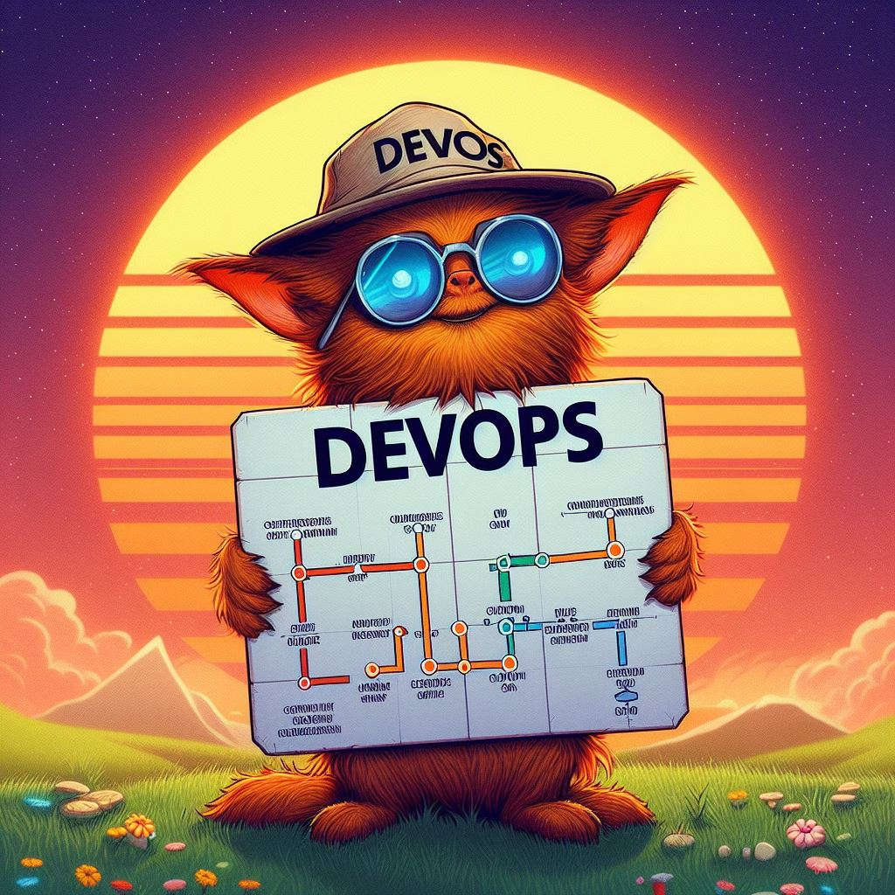

# DevOpsRoadmap

Learning from the [DevOps Roadmap](https://roadmap.sh/devops).

## Progress Tracker

| Topic                                                                                               | Completed |
| --------------------------------------------------------------------------------------------------- | --------- |
| [Application Monitoring](DevOpsRoadmap/Application-Monitoring/readme.md)                            | Yes       |
| [Artifact Management](DevOpsRoadmap/Artifact-Management/readme.md)                                  | Yes       |
| [CI/CD Tooling](DevOpsRoadmap/CICD-Tooling/readme.md)                                               | Yes       |
| [Cloud Design Patterns](DevOpsRoadmap/Cloud-Design-Patterns/readme.md)                              | Yes       |
| [Cloud Platforms (AWS, Azure, GCP)](DevOpsRoadmap/Cloud-Platforms/readme.md)                        | Yes       |
| [Configuration Management](DevOpsRoadmap/Configuration-Management/readme.md)                        | Yes       |
| [Container Orchestration ](DevOpsRoadmap/Container-Orchestration/readme.md)                         | Yes       |
| [Containerization (Docker)](DevOpsRoadmap/Containerization/readme.md)                               | Yes       |
| [GitOps](DevOpsRoadmap/GitOps/readme.md)                                                            | Yes       |
| [Infrastructure Monitoring](DevOpsRoadmap/Infrastructure-Monitoring/readme.md)                      | Yes       |
| [Infrastructure as Code Provisioning](DevOpsRoadmap/Infrastructure-As-Code-Provisioning/readme.md)  | Yes       |
| [Logs Management](DevOpsRoadmap/Logs-Management/readme.md)                                          | Yes       |
| [Networking, Security and Protocols](DevOpsRoadmap/Networking-Security-and-Protocols/readme.md)     | Yes       |
| [Operating Systems](DevOpsRoadmap/Operating-Systems/readme.md)                                      | Yes       |
| [Programming Languages](DevOpsRoadmap/Programming-Languages/readme.md)                              | Yes       |
| [Serverless Computing](DevOpsRoadmap/Serverless-Computing/readme.md)                                | Yes       |
| [Service Mesh](DevOpsRoadmap/Service-Mesh/readme.md)                                                | Yes       |
| [Terminal Usage](DevOpsRoadmap/Terminal-Usage/readme.md)                                            | Yes       |
| [Version Control Systems](DevOpsRoadmap/Version-Control-Systems/readme.md)                          | Yes       |
| [Web Server Setup](DevOpsRoadmap/Web-Server-Setup/readme.md)                                        | Yes       |
